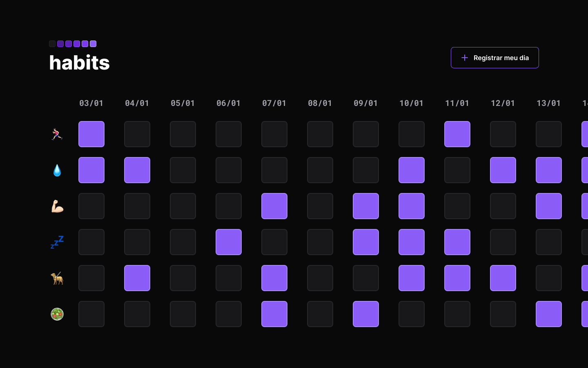

<h1 align="center">Habits</h1>

Projeto realizado pela rocketseat para ensino de tecnologias WEB.  

 <a href="#-tecnologias">Tecnologias</a>&nbsp;&nbsp;&nbsp|&nbsp;&nbsp;&nbsp;
 <a href="#-projeto">Projeto</a>&nbsp;&nbsp;&nbsp|&nbsp;&nbsp;&nbsp;
 <a href="#-Layout">Layout</a>&nbsp;&nbsp;&nbsp|&nbsp;&nbsp;&nbsp;
 <a href="#memo-licença">Licença</a>

  

 

  

## 🚀 Tecnologias

Esse projeto foi desenvolvido com as seguintes tecnologias:

- HTML e CSS
- JavaScript
- Git e Github
- Figma

## 💻 Projeto

O Habits é um app que ajuda a pessoa a organizar melhor os seus hábitos.

- [Visite o projeto online](https://rianxavier.github.io/NLW-SETUP)

## 📋 Layout

Você pode visualizar o layout do projeto através [DESSE LINK](<https://www.figma.com/file/ilqdWkSLjYSAdKprmsbw9V/Habits-(e)-(Community)?node-id=75%3A128&t=KUkC7YUynxVc3ASq-0>). É necessário ter a conta no [Figma](https://www.figma.com) para acessá-lo

## :memo: Licença

Esse projeto está sob a licença MIT.
